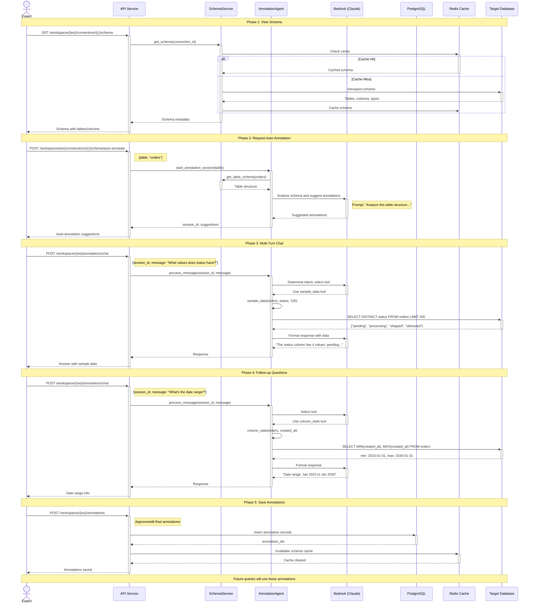
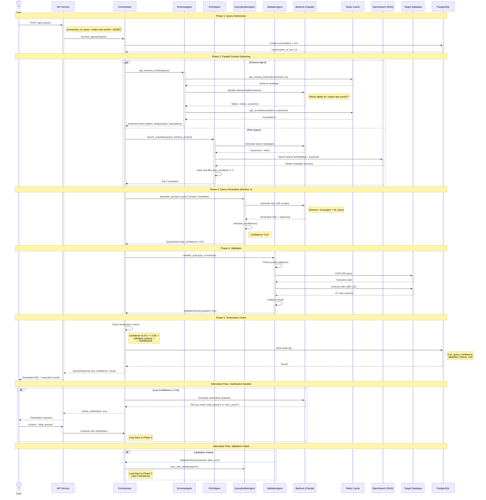

# Chat Flow - Sequence Diagrams

## Auto-Annotation Chat Flow

```mermaid
sequenceDiagram
    actor Expert
    participant API as API Service
    participant Schema as SchemaService
    participant Agent as AnnotationAgent
    participant LLM as Bedrock (Claude)
    participant DB as PostgreSQL
    participant Redis as Redis Cache
    participant Target as Target Database

    Note over Expert,Target: Phase 1: View Schema
    Expert->>+API: GET /workspaces/{ws}/connections/{c}/schema
    API->>+Schema: get_schema(connection_id)
    Schema->>+Redis: Check cache
    alt Cache Hit
        Redis-->>-Schema: Cached schema
    else Cache Miss
        Schema->>+Target: Introspect schema
        Target-->>-Schema: Tables, columns, types
        Schema->>Redis: Cache schema
    end
    Schema-->>-API: Schema metadata
    API-->>-Expert: Schema with tables/columns

    Note over Expert,Target: Phase 2: Request Auto-Annotation
    Expert->>+API: POST /workspaces/{ws}/connections/{c}/schema/auto-annotate
    Note right of API: {table: "orders"}
    API->>+Agent: start_annotation_session(table)
    Agent->>+Schema: get_table_schema(orders)
    Schema-->>-Agent: Table structure
    Agent->>+LLM: Analyze schema and suggest annotations
    Note right of LLM: Prompt: "Analyze this table structure..."
    LLM-->>-Agent: Suggested annotations
    Agent-->>-API: session_id, suggestions
    API-->>-Expert: Auto-annotation suggestions

    Note over Expert,Target: Phase 3: Multi-Turn Chat
    Expert->>+API: POST /workspaces/{ws}/annotations/chat
    Note right of API: {session_id, message: "What values does status have?"}
    API->>+Agent: process_message(session_id, message)
    Agent->>+LLM: Determine intent, select tool
    LLM-->>-Agent: Use sample_data tool
    Agent->>Agent: sample_data(orders, status, 100)
    Agent->>+Target: SELECT DISTINCT status FROM orders LIMIT 100
    Target-->>-Agent: ["pending", "processing", "shipped", "delivered"]
    Agent->>+LLM: Format response with data
    LLM-->>-Agent: "The status column has 4 values: pending..."
    Agent-->>-API: Response
    API-->>-Expert: Answer with sample data

    Note over Expert,Target: Phase 4: Follow-up Questions
    Expert->>+API: POST /workspaces/{ws}/annotations/chat
    Note right of API: {session_id, message: "What's the date range?"}
    API->>+Agent: process_message(session_id, message)
    Agent->>+LLM: Select tool
    LLM-->>-Agent: Use column_stats tool
    Agent->>Agent: column_stats(orders, created_at)
    Agent->>+Target: SELECT MIN(created_at), MAX(created_at) FROM orders
    Target-->>-Agent: min: 2023-01-01, max: 2026-01-31
    Agent->>+LLM: Format response
    LLM-->>-Agent: "Date range: Jan 2023 to Jan 2026"
    Agent-->>-API: Response
    API-->>-Expert: Date range info

    Note over Expert,Target: Phase 5: Save Annotations
    Expert->>+API: POST /workspaces/{ws}/annotations
    Note right of API: Approve/edit final annotations
    API->>+DB: Insert annotation records
    DB-->>-API: annotation_ids
    API->>+Redis: Invalidate schema cache
    Redis-->>-API: Cache cleared
    API-->>-Expert: Annotations saved

    Note over Expert,Target: Future queries will use these annotations
```

## User Query Generation Chat Flow

```mermaid
sequenceDiagram
    actor User
    participant API as API Service
    participant Orch as Orchestrator
    participant Schema as SchemaAgent
    participant RAG as RAGAgent
    participant Builder as QueryBuilderAgent
    participant Val as ValidatorAgent
    participant LLM as Bedrock (Claude)
    participant Redis as Redis Cache
    participant OpenSearch as OpenSearch (RAG)
    participant Target as Target Database
    participant DB as PostgreSQL

    Note over User,DB: Phase 1: Query Submission
    User->>+API: POST /api/v1/query
    Note right of API: {connection_id, query: "orders last month > $1000"}
    API->>+Orch: process_query(request)
    Orch->>+DB: Create conversation + turn
    DB-->>-Orch: conversation_id, turn_id

    Note over User,DB: Phase 2: Parallel Context Gathering
    par Schema Agent
        Orch->>+Schema: get_schema_context(query)
        Schema->>+Redis: get_cached_schema(connection_id)
        Redis-->>-Schema: Schema metadata
        Schema->>+LLM: Identify relevant tables/columns
        Note right of LLM: "Which tables for 'orders last month'?"
        LLM-->>-Schema: Tables: orders, customers
        Schema->>Redis: get_annotations(orders, customers)
        Redis-->>Schema: Annotations
        Schema-->>-Orch: SchemaContext (tables, relationships, annotations)
    and RAG Agent
        Orch->>+RAG: search_examples(query, schema_context)
        RAG->>+LLM: Generate search strategies
        LLM-->>-RAG: Keywords + intent
        RAG->>+OpenSearch: Hybrid search (embedding + keyword)
        OpenSearch-->>-RAG: Similar examples (scored)
        RAG->>RAG: Rank and filter (min_similarity: 0.7)
        RAG-->>-Orch: Top 5 examples
    end

    Note over User,DB: Phase 3: Query Generation (Iteration 1)
    Orch->>+Builder: generate_query(nl_query, schema, examples)
    Builder->>+LLM: Generate SQL with context
    Note right of LLM: Schema + Examples + NL Query
    LLM-->>-Builder: Generated SQL + reasoning
    Builder->>Builder: calculate_confidence()
    Note right of Builder: Confidence: 0.87
    Builder-->>-Orch: QueryResult (sql, confidence: 0.87)

    Note over User,DB: Phase 4: Validation
    Orch->>+Val: validate_query(sql, connection)
    Val->>Val: Check syntax (sqlparse)
    Val->>+Target: EXPLAIN query
    Target-->>-Val: Execution plan
    Val->>+Target: Execute with LIMIT 100
    Target-->>-Val: 47 rows returned
    Val->>Val: Analyze results
    Val-->>-Orch: ValidationResult (passed: true)

    Note over User,DB: Phase 5: Termination Check
    Orch->>Orch: Check termination criteria
    Note right of Orch: confidence (0.87) >= 0.85 ✓<br/>validation passed ✓<br/>→ TERMINATE

    Orch->>+DB: Save audit log
    Note right of DB: Turn, query, confidence,<br/>validation, tokens, cost
    DB-->>-Orch: Saved
    Orch-->>-API: QueryResponse (sql, confidence, result)
    API-->>-User: Generated SQL + execution results

    Note over User,DB: Alternative Flow: Clarification Needed
    alt Low Confidence (< 0.6)
        Orch->>+LLM: Generate clarification question
        LLM-->>-Orch: "Did you mean 'total_amount' or 'item_count'?"
        Orch-->>API: needs_clarification: true
        API-->>User: Clarification question
        User->>API: Answer: "total_amount"
        API->>Orch: Continue with clarification
        Note right of Orch: Loop back to Phase 3
    end

    Note over User,DB: Alternative Flow: Validation Failed
    alt Validation Failed
        Val-->>Orch: ValidationResult (passed: false, error)
        Orch->>Builder: retry_with_feedback(error)
        Note right of Orch: Loop back to Phase 3<br/>(max 5 iterations)
    end
```
