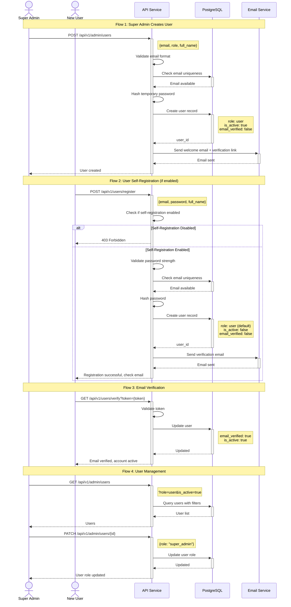
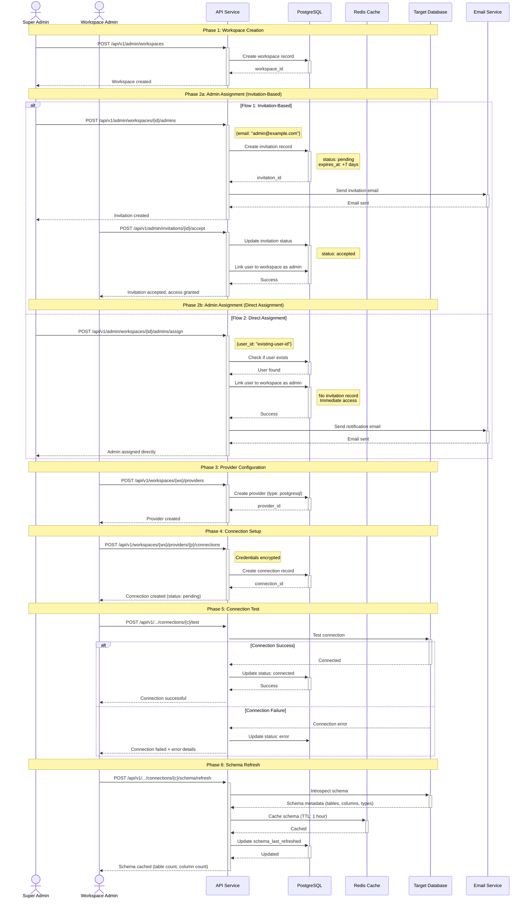
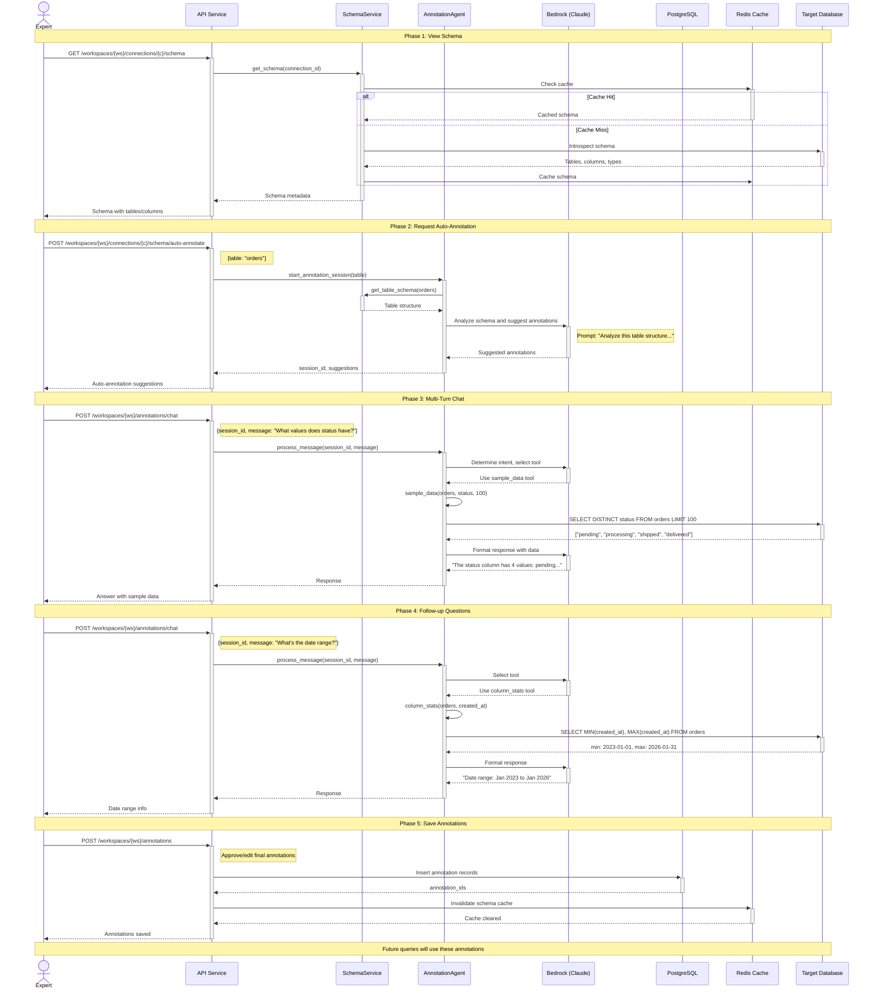
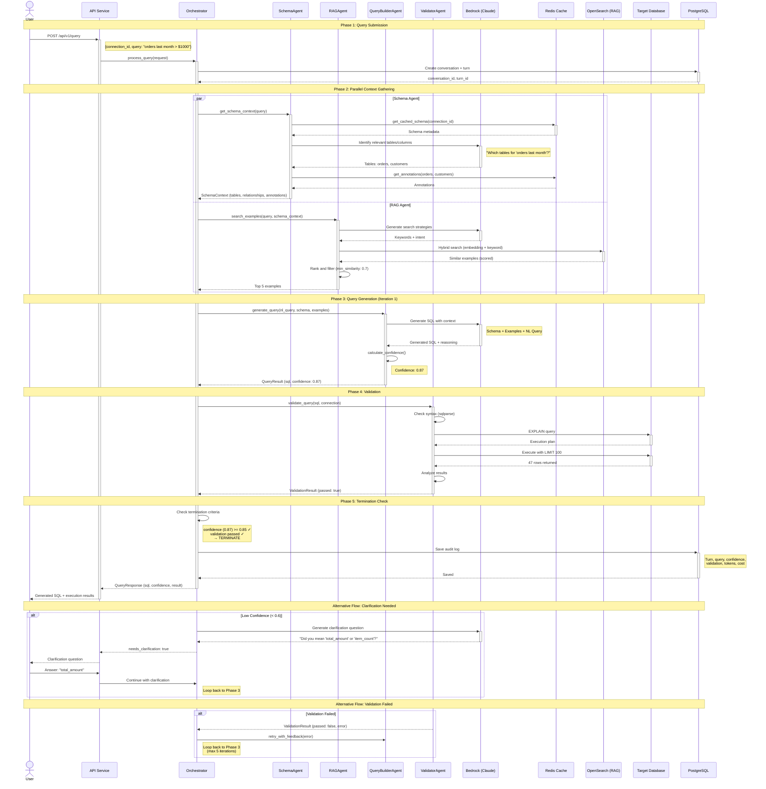
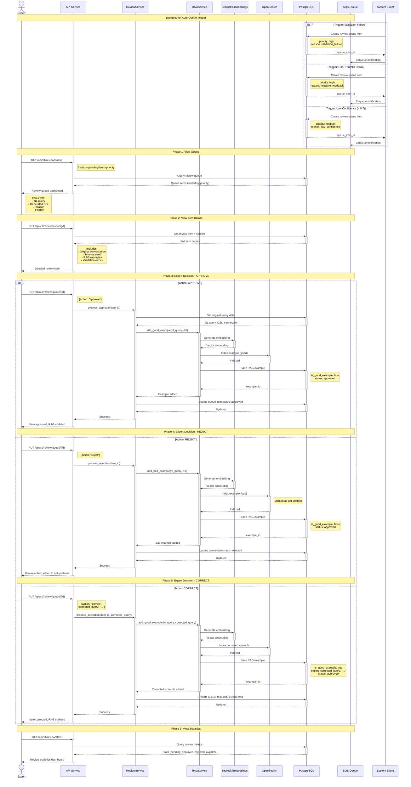
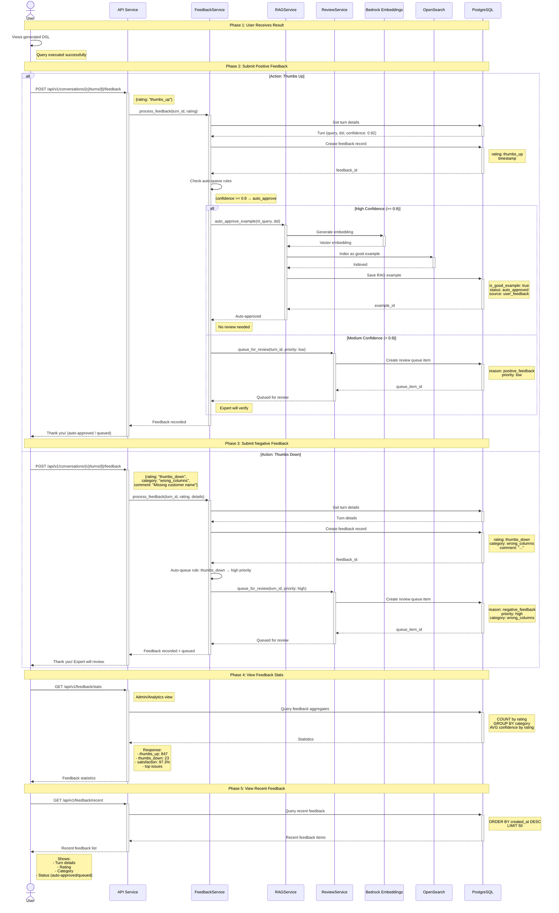

# Text-to-X System Architecture Design

## 1. Overview

A multi-agent system that converts natural language queries into executable queries (SQL, NoSQL, Splunk SPL, etc.) with >=95% accuracy through iterative refinement, RAG-powered examples, and expert feedback loops.

### Key Design Principles
- **Multi-Tenancy**: Workspace → Provider → Connection hierarchy for isolation
- **Agentic over Reactive**: Autonomous agents with specialized roles instead of REACT loops
- **Parallel Processing**: Sub-agents run concurrently where dependencies allow
- **Iterative Refinement**: Loop until confidence + validation thresholds met
- **Pluggable Providers**: Abstract interface for different query targets
- **Continuous Learning**: Expert-reviewed examples immediately enhance RAG

---

## 2. High-Level Architecture

```
┌─────────────────────────────────────────────────────────────────────────────┐
│                              CLIENT LAYER                                    │
│  ┌─────────────┐  ┌─────────────┐  ┌─────────────┐  ┌─────────────┐        │
│  │   Web UI    │  │    API      │  │    CLI      │  │    SDK      │        │
│  └─────────────┘  └─────────────┘  └─────────────┘  └─────────────┘        │
└─────────────────────────────────────────────────────────────────────────────┘
                                      │
                                      ▼
┌─────────────────────────────────────────────────────────────────────────────┐
│                         MULTI-TENANCY LAYER                                  │
│  ┌─────────────────────────────────────────────────────────────────────┐    │
│  │  Workspace → Provider → Connection                                   │    │
│  │  - Logical isolation per team/project                                │    │
│  │  - Multiple DB types per workspace                                   │    │
│  │  - Multiple connections per provider (dev/staging/prod)              │    │
│  │  - Schema caching per connection (Redis)                             │    │
│  └─────────────────────────────────────────────────────────────────────┘    │
└─────────────────────────────────────────────────────────────────────────────┘
                                      │
                                      ▼
┌─────────────────────────────────────────────────────────────────────────────┐
│                           ORCHESTRATION LAYER                                │
│  ┌─────────────────────────────────────────────────────────────────────┐    │
│  │                      Orchestrator Agent                              │    │
│  │  - Session management & conversation state                           │    │
│  │  - Agent coordination & parallel dispatch                            │    │
│  │  - Termination logic (confidence + validation)                       │    │
│  │  - User clarification requests                                       │    │
│  └─────────────────────────────────────────────────────────────────────┘    │
└─────────────────────────────────────────────────────────────────────────────┘
                                      │
              ┌───────────────────────┼───────────────────────┐
              ▼                       ▼                       ▼
┌───────────────────────┐ ┌───────────────────────┐ ┌───────────────────────┐
│  Schema Expert Agent  │ │  Query Builder Agent  │ │   Validator Agent     │
│                       │ │                       │ │                       │
│  - Schema retrieval   │ │  - RAG example fetch  │ │  - Syntax validation  │
│  - Table/field mapping│ │  - Query generation   │ │  - Execution testing  │
│  - Annotation lookup  │ │  - Multi-attempt loop │ │  - Result verification│
│  - Context enrichment │ │  - Confidence scoring │ │  - Error diagnosis    │
└───────────────────────┘ └───────────────────────┘ └───────────────────────┘
                                      │
              ┌───────────────────────┼───────────────────────┐
              ▼                       ▼                       ▼
┌─────────────────────────────────────────────────────────────────────────────┐
│                            PROVIDER LAYER                                    │
│  ┌─────────────┐  ┌─────────────┐  ┌─────────────┐  ┌─────────────┐        │
│  │SQL Provider │  │NoSQL Provider│ │Splunk Provider│ │Custom Provider│      │
│  │ (Postgres,  │  │  (MongoDB,  │  │    (SPL)    │  │   (Plugin)  │        │
│  │  MySQL...)  │  │  DynamoDB)  │  │             │  │             │        │
│  └─────────────┘  └─────────────┘  └─────────────┘  └─────────────┘        │
└─────────────────────────────────────────────────────────────────────────────┘
                                      │
                                      ▼
┌─────────────────────────────────────────────────────────────────────────────┐
│                        DATA & KNOWLEDGE LAYER                                │
│  ┌──────────────────┐  ┌──────────────────┐  ┌──────────────────┐          │
│  │  AWS OpenSearch  │  │    PostgreSQL    │  │   Schema Cache   │          │
│  │   (RAG Store)    │  │  (Conversations, │  │  (Redis/Memory)  │          │
│  │  - Good examples │  │   Audit Logs,    │  │  + Annotations   │          │
│  │  - Bad examples  │  │  Expert Queue)   │  │                  │          │
│  └──────────────────┘  └──────────────────┘  └──────────────────┘          │
└─────────────────────────────────────────────────────────────────────────────┘
                                      │
                                      ▼
┌─────────────────────────────────────────────────────────────────────────────┐
│                         EXPERT REVIEW LAYER                                  │
│  ┌─────────────────────────────────────────────────────────────────────┐    │
│  │                      Expert Review UI                                │    │
│  │  - Review queue dashboard                                            │    │
│  │  - Query correction interface                                        │    │
│  │  - Good/bad example approval                                         │    │
│  │  - Immediate RAG indexing on approval                                │    │
│  └─────────────────────────────────────────────────────────────────────┘    │
└─────────────────────────────────────────────────────────────────────────────┘
```

---

## 3. Agent Specifications

### 3.1 Orchestrator Agent

**Role**: Central coordinator managing conversation flow and agent dispatch

**Responsibilities**:
- Receive user natural language input
- Manage multi-turn conversation state (persistent in DB)
- Dispatch work to sub-agents in parallel where possible
- Implement termination logic: `confidence >= threshold AND validation_passed`
- Request user clarification when confidence is low
- Track and expose full reasoning trace
- Handle retry with exponential backoff on LLM failures

**Termination Criteria** (Hybrid):
```python
def should_terminate(result: QueryResult) -> bool:
    return (
        result.confidence_score >= CONFIDENCE_THRESHOLD  # e.g., 0.85
        and result.validation_status == ValidationStatus.PASSED
    ) or result.iteration_count >= MAX_ITERATIONS  # e.g., 5
```

**Parallel Dispatch Strategy**:
```
Phase 1 (Parallel):
├── Schema Expert Agent: Retrieve relevant schema context
└── RAG Retrieval Agent: Fetch similar examples from OpenSearch

Phase 2 (After Phase 1):
└── Query Builder Agent: Generate query using schema + examples

Phase 3 (After Phase 2):
└── Validator Agent: Validate and execute query

Phase 4 (If validation fails, loop back to Phase 2 with error context)
```

### 3.2 Schema Expert Agent

**Role**: Database schema understanding and context enrichment

**Responsibilities**:
- Query schema metadata store for relevant tables/fields
- Retrieve user-provided annotations for schema elements
- Build schema context document for Query Builder
- Cache common schemas, retrieve on-demand for complex queries
- Map natural language terms to schema elements

**Tools Available**:
- `get_schema(provider_id, database)` → Full schema
- `search_tables(keywords)` → Relevant tables
- `get_annotations(table, field)` → User annotations
- `get_relationships(table)` → Foreign keys, joins

**Output**:
```python
@dataclass
class SchemaContext:
    relevant_tables: List[TableInfo]
    relationships: List[Relationship]
    annotations: Dict[str, str]  # field -> annotation
    suggested_joins: List[JoinPath]
```

### 3.3 Query Builder Agent

**Role**: Generate executable queries through iterative refinement

**Responsibilities**:
- Consume schema context and RAG examples
- Generate candidate queries with confidence scores
- Self-critique and refine based on validation feedback
- Track reasoning steps for explainability
- Support multiple query dialects via provider abstraction

**RAG Query Strategy**:
```python
class RAGSearchStrategy:
    async def search_examples(self, user_query: str, schema_context: SchemaContext) -> List[Example]:
        # Agent decides search approach based on query characteristics
        strategies = [
            self.keyword_search(extract_keywords(user_query)),
            self.embedding_search(embed(user_query)),
            self.schema_aware_search(user_query, schema_context.relevant_tables),
            self.intent_based_search(classify_intent(user_query))
        ]
        # Run searches in parallel, merge and rank results
        results = await asyncio.gather(*strategies)
        return self.merge_and_rank(results)
```

**Confidence Scoring**:
```python
def calculate_confidence(self, query: str, context: Context) -> float:
    factors = {
        'schema_coverage': self.check_schema_coverage(query, context),
        'example_similarity': self.best_example_similarity,
        'query_complexity': self.assess_complexity(query),
        'ambiguity_score': self.detect_ambiguity(context.user_input),
    }
    return weighted_average(factors, weights=CONFIDENCE_WEIGHTS)
```

### 3.4 Validator Agent

**Role**: Validate query correctness through execution

**Responsibilities**:
- Check query syntax validity
- Execute query against target system (if provider supports)
- Analyze execution results for correctness
- Generate diagnostic feedback for Query Builder on failure
- Track validation metrics

**Validation Pipeline**:
```
┌─────────────┐    ┌─────────────┐    ┌─────────────┐    ┌─────────────┐
│   Syntax    │───▶│  Semantic   │───▶│  Execution  │───▶│   Result    │
│   Check     │    │   Check     │    │    Test     │    │  Analysis   │
└─────────────┘    └─────────────┘    └─────────────┘    └─────────────┘
       │                 │                  │                  │
       ▼                 ▼                  ▼                  ▼
  Parse query      Check table/       Run query with    Verify result
  for syntax       field existence    LIMIT/timeout     makes sense
```

### 3.5 RAG Retrieval Agent

**Role**: Intelligent retrieval of relevant examples from OpenSearch

**Responsibilities**:
- Construct optimal search queries (keyword + embedding hybrid)
- Iterate through multiple search strategies until quality threshold met
- Rank and filter results by relevance
- Distinguish between good examples (to follow) and bad examples (to avoid)

---

## 4. Multi-Tenancy & Connection Management

### 4.1 Data Model Hierarchy

The system supports multi-tenancy through a hierarchical workspace structure:

```
┌─────────────────────────────────────────────────────────────────────────────┐
│                           WORKSPACE HIERARCHY                                │
│                                                                              │
│  Workspace (Team/Project Grouping)                                          │
│  ├── Settings, slug, description                                            │
│  │                                                                           │
│  └── Provider (Database Type)                                               │
│      ├── Type: postgresql, mysql, athena, bigquery, snowflake,              │
│      │         redshift, mongodb, opensearch, elasticsearch, splunk         │
│      ├── Settings (timeouts, defaults)                                      │
│      │                                                                       │
│      └── Connection (Specific Database Instance)                            │
│          ├── Host, port, database, schema_name                              │
│          ├── Credentials (encrypted JSONB)                                  │
│          ├── Connection options (SSL, etc.)                                 │
│          ├── Status: pending, connected, disconnected, error                │
│          ├── Schema cache key (Redis)                                       │
│          └── Last schema refresh timestamp                                  │
└─────────────────────────────────────────────────────────────────────────────┘
```

### 4.2 Entity Relationships

```
┌───────────────┐         ┌───────────────┐         ┌───────────────┐
│   Workspace   │ 1────n  │   Provider    │ 1────n  │  Connection   │
├───────────────┤         ├───────────────┤         ├───────────────┤
│ id (UUID)     │         │ id (UUID)     │         │ id (UUID)     │
│ name          │         │ workspace_id  │◄────────│ provider_id   │
│ slug (unique) │         │ name          │         │ name          │
│ description   │         │ type (enum)   │         │ host          │
│ settings      │         │ description   │         │ port          │
│ created_at    │         │ settings      │         │ database      │
│ updated_at    │         │ created_at    │         │ schema_name   │
└───────────────┘         │ updated_at    │         │ credentials   │
                          └───────────────┘         │ status        │
                                                    │ schema_cache  │
                                                    └───────────────┘
                                                           │
                                                           │ 1
                                                           │
                                                           ▼ n
                                                    ┌───────────────┐
                                                    │ Conversation  │
                                                    ├───────────────┤
                                                    │ connection_id │
                                                    │ user_id       │
                                                    │ status        │
                                                    └───────────────┘
```

### 4.3 Database Models

```python
class ProviderType(str, Enum):
    """Supported database provider types"""
    POSTGRESQL = "postgresql"
    MYSQL = "mysql"
    ATHENA = "athena"
    BIGQUERY = "bigquery"
    SNOWFLAKE = "snowflake"
    REDSHIFT = "redshift"
    MONGODB = "mongodb"
    OPENSEARCH = "opensearch"
    ELASTICSEARCH = "elasticsearch"
    SPLUNK = "splunk"

class ConnectionStatus(str, Enum):
    """Connection health status"""
    PENDING = "pending"        # Not yet tested
    CONNECTED = "connected"    # Successfully connected
    DISCONNECTED = "disconnected"  # Failed to connect
    ERROR = "error"            # Connection error

@dataclass
class Workspace:
    id: UUID
    name: str
    slug: str  # URL-friendly unique identifier
    description: Optional[str]
    settings: Dict[str, Any]  # Workspace-specific settings
    created_at: datetime
    updated_at: datetime
    providers: List["Provider"]  # One-to-many relationship

@dataclass
class Provider:
    id: UUID
    workspace_id: UUID
    name: str
    type: ProviderType
    description: Optional[str]
    settings: Dict[str, Any]  # Provider-specific settings
    created_at: datetime
    updated_at: datetime
    connections: List["Connection"]  # One-to-many relationship

@dataclass
class Connection:
    id: UUID
    provider_id: UUID
    name: str  # e.g., "Production", "Staging", "Analytics"
    host: str
    port: Optional[int]
    database: str
    schema_name: Optional[str]
    credentials: Dict[str, Any]  # Encrypted at rest
    connection_options: Dict[str, Any]
    status: ConnectionStatus
    last_health_check: Optional[datetime]
    status_message: Optional[str]
    schema_cache_key: Optional[str]  # Redis key
    schema_last_refreshed: Optional[datetime]
    created_at: datetime
    updated_at: datetime
```

### 4.4 API Structure

```yaml
# Workspace Management
GET    /api/v1/workspaces                                    # List all
POST   /api/v1/workspaces                                    # Create
GET    /api/v1/workspaces/{workspace_id}                     # Get by ID
PATCH  /api/v1/workspaces/{workspace_id}                     # Update
DELETE /api/v1/workspaces/{workspace_id}                     # Delete (cascades)

# Provider Management (nested under workspace)
GET    /api/v1/workspaces/{workspace_id}/providers           # List providers
POST   /api/v1/workspaces/{workspace_id}/providers           # Create provider
GET    /api/v1/workspaces/{workspace_id}/providers/{id}      # Get provider
PATCH  /api/v1/workspaces/{workspace_id}/providers/{id}      # Update provider
DELETE /api/v1/workspaces/{workspace_id}/providers/{id}      # Delete (cascades)

# Connection Management (nested under provider)
GET    /api/v1/workspaces/{ws_id}/providers/{prov_id}/connections
POST   /api/v1/workspaces/{ws_id}/providers/{prov_id}/connections
GET    /api/v1/workspaces/{ws_id}/providers/{prov_id}/connections/{id}
PATCH  /api/v1/workspaces/{ws_id}/providers/{prov_id}/connections/{id}
DELETE /api/v1/workspaces/{ws_id}/providers/{prov_id}/connections/{id}
POST   /api/v1/workspaces/{ws_id}/providers/{prov_id}/connections/{id}/test
POST   /api/v1/workspaces/{ws_id}/providers/{prov_id}/connections/{id}/schema/refresh
```

### 4.5 Schema Caching Strategy

```
┌─────────────────┐         ┌─────────────────┐         ┌─────────────────┐
│   Connection    │         │      Redis      │         │   Target DB     │
│                 │         │  Schema Cache   │         │                 │
└────────┬────────┘         └────────┬────────┘         └────────┬────────┘
         │                           │                           │
         │  1. Check cache           │                           │
         │────────────────────────►  │                           │
         │                           │                           │
         │  2a. Cache HIT            │                           │
         │◄────────────────────────  │                           │
         │     (return schema)       │                           │
         │                           │                           │
         │  2b. Cache MISS           │                           │
         │◄────────────────────────  │                           │
         │                           │                           │
         │  3. Introspect schema     │                           │
         │──────────────────────────────────────────────────────►│
         │                           │                           │
         │  4. Schema response       │                           │
         │◄──────────────────────────────────────────────────────│
         │                           │                           │
         │  5. Store in cache        │                           │
         │────────────────────────►  │                           │
         │                           │                           │
```

---

## 5. Provider Abstraction

### 5.1 Provider Interface

```python
from abc import ABC, abstractmethod
from typing import Optional, List, Dict, Any
from enum import Enum

class ProviderCapability(Enum):
    SCHEMA_INTROSPECTION = "schema_introspection"
    QUERY_VALIDATION = "query_validation"
    QUERY_EXECUTION = "query_execution"
    QUERY_EXPLANATION = "query_explanation"
    DRY_RUN = "dry_run"
    COST_ESTIMATION = "cost_estimation"

class QueryProvider(ABC):
    """Base interface for all query providers"""

    @abstractmethod
    def get_provider_id(self) -> str:
        """Unique identifier for this provider"""
        pass

    @abstractmethod
    def get_query_language(self) -> str:
        """e.g., 'SQL', 'SPL', 'MongoDB Query', 'GraphQL'"""
        pass

    @abstractmethod
    def get_capabilities(self) -> List[ProviderCapability]:
        """List of capabilities this provider supports"""
        pass

    @abstractmethod
    async def get_schema(self) -> SchemaDefinition:
        """Retrieve the schema/structure of the target system"""
        pass

    @abstractmethod
    async def validate_syntax(self, query: str) -> ValidationResult:
        """Check if query is syntactically valid"""
        pass

    async def execute_query(self, query: str, limit: int = 100) -> Optional[ExecutionResult]:
        """Execute query and return results (optional)"""
        if ProviderCapability.QUERY_EXECUTION not in self.get_capabilities():
            return None
        raise NotImplementedError()

    async def explain_query(self, query: str) -> Optional[str]:
        """Return execution plan or explanation (optional)"""
        if ProviderCapability.QUERY_EXPLANATION not in self.get_capabilities():
            return None
        raise NotImplementedError()
```

### 5.2 Provider Implementations

#### SQL Provider
```python
class SQLProvider(QueryProvider):
    def __init__(self, connection_config: SQLConnectionConfig):
        self.engine = create_engine(connection_config.connection_string)
        self.dialect = connection_config.dialect  # postgres, mysql, etc.

    def get_provider_id(self) -> str:
        return f"sql_{self.dialect}"

    def get_query_language(self) -> str:
        return "SQL"

    def get_capabilities(self) -> List[ProviderCapability]:
        return [
            ProviderCapability.SCHEMA_INTROSPECTION,
            ProviderCapability.QUERY_VALIDATION,
            ProviderCapability.QUERY_EXECUTION,
            ProviderCapability.QUERY_EXPLANATION,
        ]

    async def get_schema(self) -> SchemaDefinition:
        inspector = inspect(self.engine)
        tables = []
        for table_name in inspector.get_table_names():
            columns = inspector.get_columns(table_name)
            foreign_keys = inspector.get_foreign_keys(table_name)
            tables.append(TableSchema(
                name=table_name,
                columns=[ColumnInfo(**col) for col in columns],
                foreign_keys=foreign_keys
            ))
        return SchemaDefinition(tables=tables)

    async def validate_syntax(self, query: str) -> ValidationResult:
        try:
            parsed = sqlparse.parse(query)
            return ValidationResult(valid=True)
        except Exception as e:
            return ValidationResult(valid=False, error=str(e))

    async def execute_query(self, query: str, limit: int = 100) -> ExecutionResult:
        safe_query = self._ensure_limit(query, limit)
        with self.engine.connect() as conn:
            result = conn.execute(text(safe_query))
            rows = result.fetchall()
            return ExecutionResult(
                success=True,
                row_count=len(rows),
                columns=result.keys(),
                sample_rows=rows[:10]
            )
```

---

## 6. Data Models

### 6.1 Conversation & Session

```python
@dataclass
class Conversation:
    id: UUID
    user_id: str
    provider_id: str
    created_at: datetime
    updated_at: datetime
    status: ConversationStatus  # active, completed, abandoned
    turns: List[ConversationTurn]

@dataclass
class ConversationTurn:
    id: UUID
    conversation_id: UUID
    turn_number: int
    user_input: str
    system_response: QueryResponse
    reasoning_trace: ReasoningTrace
    created_at: datetime

@dataclass
class QueryResponse:
    generated_query: str
    confidence_score: float
    validation_result: ValidationResult
    execution_result: Optional[ExecutionResult]
    iterations: int
    clarification_needed: bool
    clarification_question: Optional[str]
```

### 6.2 RAG Examples

```python
@dataclass
class RAGExample:
    id: UUID
    provider_id: str
    natural_language_query: str
    generated_query: str
    is_good_example: bool  # True for good, False for bad
    status: ExampleStatus  # pending_review, approved, rejected

    # Metadata for retrieval
    involved_tables: List[str]
    query_intent: str  # aggregation, filter, join, etc.
    complexity_level: str  # simple, medium, complex

    # Review info
    reviewed_by: Optional[str]
    reviewed_at: Optional[datetime]
    expert_corrected_query: Optional[str]

    # Embeddings (stored in OpenSearch)
    question_embedding: List[float]
    created_at: datetime
    source_conversation_id: Optional[UUID]
```

### 6.3 Audit Log

```python
@dataclass
class AuditLog:
    id: UUID
    conversation_id: UUID
    turn_id: UUID

    # Request details
    user_input: str
    provider_id: str

    # Processing details
    schema_context_used: Dict
    rag_examples_retrieved: List[UUID]
    iterations: int

    # Agent traces
    schema_agent_trace: AgentTrace
    query_builder_trace: AgentTrace
    validator_trace: AgentTrace

    # Results
    final_query: str
    confidence_score: float
    validation_status: str
    execution_success: bool

    # Costs
    total_tokens_input: int
    total_tokens_output: int
    total_cost_usd: float
    model_used: str

    # Timing
    total_latency_ms: int
    created_at: datetime
```

---

## 7. Core Flows

### 7.1 Query Processing Flow

```
User Input: "Show me all orders from last month with total > $1000"
                                      │
                                      ▼
┌─────────────────────────────────────────────────────────────────────────────┐
│ 1. ORCHESTRATOR RECEIVES REQUEST                                            │
│    - Create/resume conversation session                                     │
│    - Initialize audit log entry                                             │
│    - Determine target provider                                              │
└─────────────────────────────────────────────────────────────────────────────┘
                                      │
                                      ▼
┌─────────────────────────────────────────────────────────────────────────────┐
│ 2. PARALLEL CONTEXT GATHERING                                               │
│    ┌─────────────────────────────┐  ┌─────────────────────────────┐        │
│    │   Schema Expert Agent       │  │   RAG Retrieval Agent       │        │
│    │   • Query schema cache      │  │   • Multi-strategy search   │        │
│    │   • Find: orders, customers │  │   • Find similar examples   │        │
│    │   • Get field annotations   │  │   • Rank by relevance       │        │
│    └─────────────────────────────┘  └─────────────────────────────┘        │
└─────────────────────────────────────────────────────────────────────────────┘
                                      │
                                      ▼
┌─────────────────────────────────────────────────────────────────────────────┐
│ 3. QUERY GENERATION LOOP (max N iterations)                                 │
│    Query Builder Agent generates:                                           │
│    SELECT o.*, c.name                                                       │
│    FROM orders o                                                            │
│    JOIN customers c ON o.customer_id = c.id                                 │
│    WHERE o.created_at >= DATE_TRUNC('month', NOW() - INTERVAL '1 month')    │
│      AND o.total_amount > 1000;                                             │
│    Confidence: 0.87                                                         │
└─────────────────────────────────────────────────────────────────────────────┘
                                      │
                                      ▼
┌─────────────────────────────────────────────────────────────────────────────┐
│ 4. VALIDATION                                                               │
│    Validator Agent:                                                         │
│    • Syntax check: ✓ Valid SQL                                              │
│    • Semantic check: ✓ Tables/columns exist                                 │
│    • Execution test: ✓ Query runs successfully                              │
│    • Result check: ✓ Returns 47 rows                                        │
│    Validation Status: PASSED                                                │
└─────────────────────────────────────────────────────────────────────────────┘
                                      │
                                      ▼
┌─────────────────────────────────────────────────────────────────────────────┐
│ 5. TERMINATION CHECK                                                        │
│    confidence (0.87) >= threshold (0.85)? ✓                                 │
│    validation passed? ✓                                                     │
│    → TERMINATE and return result                                            │
└─────────────────────────────────────────────────────────────────────────────┘
```

---

## 8. Technology Stack

### 8.1 Core Components

| Component | Technology | Purpose |
|-----------|------------|---------|
| Runtime | AWS AgentCore | Agent execution environment |
| Agent Framework | Strands SDK / Claude Agent SDK | Multi-agent orchestration, parallel execution |
| LLM Gateway | Bedrock + LiteLLM | Model access with provider abstraction |
| API Layer | Python FastAPI | REST/WebSocket API |
| RAG Store | AWS OpenSearch | Keyword + embedding search |
| Primary DB | PostgreSQL | Conversations, audit logs, review queue |
| Schema Cache | Redis | Hot schema cache + annotations |
| Message Queue | SQS/Redis | Async review queue processing |

### 8.2 LLM Configuration

```python
LLM_CONFIGS = {
    "default": {
        "provider": "bedrock",
        "model": "anthropic.claude-3-5-sonnet-20241022-v2:0",
        "temperature": 0.1,
        "max_tokens": 4096,
    },
    "high_accuracy": {
        "provider": "bedrock",
        "model": "anthropic.claude-3-5-opus-20240229-v1:0",
        "temperature": 0.0,
        "max_tokens": 8192,
    },
    "fast_validation": {
        "provider": "bedrock",
        "model": "anthropic.claude-3-haiku-20240307-v1:0",
        "temperature": 0.0,
        "max_tokens": 2048,
    },
}

AGENT_MODEL_MAPPING = {
    "orchestrator": "default",
    "schema_expert": "default",
    "query_builder": "high_accuracy",
    "validator": "fast_validation",
    "rag_retrieval": "fast_validation",
}
```

---

## 9. API Design

### 9.1 REST Endpoints

```yaml
# Query Processing
POST /api/v1/query
  Request:
    provider_id: string
    query: string
    conversation_id?: string  # For multi-turn
    options:
      max_iterations?: int
      confidence_threshold?: float
      trace_level?: "none" | "summary" | "full"
  Response:
    conversation_id: string
    turn_id: string
    generated_query: string
    confidence_score: float
    validation_status: string
    execution_result?: object
    reasoning_trace?: object
    needs_clarification: bool
    clarification_questions?: array

# Conversation Management
GET  /api/v1/conversations/{id}
GET  /api/v1/conversations/{id}/turns
POST /api/v1/conversations/{id}/feedback

# Provider Management
GET  /api/v1/providers
GET  /api/v1/providers/{id}/schema
POST /api/v1/providers/{id}/schema/refresh

# Expert Review
GET  /api/v1/review/queue
PUT  /api/v1/review/queue/{id}

# RAG Management
GET  /api/v1/examples
POST /api/v1/examples
```

### 9.2 WebSocket for Streaming

```python
@websocket("/ws/query")
async def query_stream(websocket: WebSocket):
    await websocket.accept()
    async for message in websocket.iter_json():
        request = QueryRequest(**message)
        async for event in orchestrator.process_query_stream(request):
            await websocket.send_json({
                "type": event.type,  # "progress", "clarification", "result"
                "data": event.data,
                "trace": event.trace if request.trace_level != "none" else None,
            })
```

---

## 10. Observability & Monitoring

### 10.1 Metrics

```python
METRICS = {
    # Accuracy metrics
    "query_success_rate": Counter,
    "validation_pass_rate": Counter,
    "user_satisfaction_rate": Counter,

    # Performance metrics
    "query_latency_seconds": Histogram,
    "iterations_per_query": Histogram,
    "agent_latency_by_type": Histogram,

    # Cost metrics
    "tokens_used_total": Counter,
    "cost_usd_total": Counter,
    "tokens_by_agent": Counter,

    # RAG metrics
    "rag_retrieval_count": Counter,
    "rag_example_usage_rate": Gauge,

    # Review metrics
    "review_queue_size": Gauge,
    "review_completion_time": Histogram,
}
```

---

## 11. Schema Annotation System

### 11.1 Annotation Model

```python
@dataclass
class SchemaAnnotation:
    """User-provided hints to help LLM understand schema"""
    provider_id: str

    # Target (one of these will be set)
    table_name: Optional[str]
    column_name: Optional[str]  # format: "table.column"

    # Annotation content
    description: str
    business_terms: List[str]  # Alternative names users might use
    examples: List[str]
    relationships: List[str]

    # Special handling hints
    date_format: Optional[str]
    enum_values: Optional[List[str]]
    sensitive: bool  # PII or sensitive data flag

    created_by: str
    created_at: datetime
    updated_at: datetime
```

### 11.2 Annotation Examples

```yaml
annotations:
  - table: orders
    description: "Customer purchase orders"
    business_terms: ["purchases", "sales", "transactions"]

  - column: orders.status
    description: "Order fulfillment status"
    enum_values: ["pending", "processing", "shipped", "delivered", "cancelled"]
    business_terms: ["order state", "fulfillment status"]

  - column: orders.created_at
    description: "When the order was placed"
    date_format: "TIMESTAMP WITH TIME ZONE"
    business_terms: ["order date", "purchase date", "when ordered"]
```

---

## 12. Deployment Architecture

```
┌─────────────────────────────────────────────────────────────────────────────┐
│                                AWS CLOUD                                     │
│                                                                              │
│  ┌──────────────────────────────────────────────────────────────────────┐   │
│  │                              VPC                                      │   │
│  │                                                                       │   │
│  │  ┌──────────────────┐    ┌──────────────────┐                        │   │
│  │  │   ALB / API GW   │    │   CloudFront     │                        │   │
│  │  │  (REST + WS)     │    │  (Expert UI)     │                        │   │
│  │  └────────┬─────────┘    └────────┬─────────┘                        │   │
│  │           │                       │                                   │   │
│  │           ▼                       ▼                                   │   │
│  │  ┌──────────────────────────────────────────────────────────┐        │   │
│  │  │                ECS Fargate / EKS                          │        │   │
│  │  │  ┌─────────────┐  ┌─────────────┐  ┌─────────────┐       │        │   │
│  │  │  │ API Service │  │Agent Workers│  │ Expert UI   │       │        │   │
│  │  │  │  (FastAPI)  │  │ (AgentCore) │  │  (React)    │       │        │   │
│  │  │  └─────────────┘  └─────────────┘  └─────────────┘       │        │   │
│  │  └──────────────────────────────────────────────────────────┘        │   │
│  │           │                       │                                   │   │
│  │           ▼                       ▼                                   │   │
│  │  ┌─────────────┐  ┌─────────────┐  ┌─────────────┐                   │   │
│  │  │   Bedrock   │  │ OpenSearch  │  │     RDS     │                   │   │
│  │  │   (LLMs)    │  │   (RAG)     │  │ (PostgreSQL)│                   │   │
│  │  └─────────────┘  └─────────────┘  └─────────────┘                   │   │
│  │                                                                       │   │
│  │  ┌─────────────┐  ┌──────────────┐                                   │   │
│  │  │ElastiCache  │  │     SQS      │                                   │   │
│  │  │  (Redis)    │  │(Review Queue)│                                   │   │
│  │  └─────────────┘  └──────────────┘                                   │   │
│  │                                                                       │   │
│  └──────────────────────────────────────────────────────────────────────┘   │
│                                                                              │
│  ┌──────────────────────────────────────────────────────────────────────┐   │
│  │                         Observability                                 │   │
│  │   CloudWatch │ X-Ray │ CloudWatch Logs │ CloudWatch Dashboards       │   │
│  └──────────────────────────────────────────────────────────────────────┘   │
│                                                                              │
└─────────────────────────────────────────────────────────────────────────────┘
```

---

## 13. Success Metrics & Targets

| Metric | Target | Measurement Method |
|--------|--------|-------------------|
| Query Accuracy | ≥95% | User feedback (thumbs up) |
| Validation Pass Rate | ≥98% | Queries that execute without error |
| Clarification Rate | <15% | Queries requiring user clarification |
| Expert Review Rate | <10% | Queries sent to expert queue |
| RAG Hit Rate | ≥80% | Queries with relevant example retrieved |
| Avg Iterations | <2.5 | Iterations before success |
| Expert Review Turnaround | <24h | Time from queue to resolution |

---

## 14. Future Enhancements

1. **Query Caching**: Cache frequently asked queries for instant response
2. **Auto-Learning**: Automatically promote high-confidence queries to RAG without expert review
3. **Query Templates**: Support parameterized query templates for common patterns
4. **Multi-Database Joins**: Support queries spanning multiple databases/providers
5. **Query Optimization Agent**: Suggest query optimizations for performance
6. **Scheduled Queries**: Support recurring query execution with alerting
7. **Natural Language Results**: Translate query results back to natural language summaries

---

## Appendix A: Configuration Reference

```yaml
orchestrator:
  max_iterations: 5
  confidence_threshold: 0.85
  clarification_threshold: 0.6

agents:
  schema_expert:
    cache_ttl_seconds: 3600
    max_tables_in_context: 20
  query_builder:
    model: "high_accuracy"
    temperature: 0.1
    max_examples: 5
  validator:
    execution_timeout_seconds: 30
    max_result_rows: 100
  rag_retrieval:
    max_iterations: 3
    min_similarity: 0.7
    keyword_weight: 0.3
    embedding_weight: 0.7

providers:
  sql_postgres:
    type: sql
    dialect: postgresql
    capabilities:
      - schema_introspection
      - query_validation
      - query_execution
      - query_explanation

review:
  triggers:
    low_confidence_threshold: 0.7
    validation_failure: true
    negative_feedback: true
  queue:
    priority_weights:
      validation_failure: 1
      negative_feedback: 2
      low_confidence: 3

observability:
  trace_retention_days: 90
  metrics_namespace: "text2x"
  log_level: "INFO"
```

---

## 15. User Scenarios & Workflows

This section defines the key user flows that the system must support end-to-end.

### 15.0 Scenario 0: User Management

**Actors:** Super Admin, User

**Flow:**
1. Super Admin can create users manually (internal user management)
2. Users can self-register (if self-registration is enabled in settings)
3. Users have roles: super_admin, user (default)
4. Super Admins can list, view, update, and delete users
5. Users can view and update their own profile

**Current Implementation Note:**
The current system uses **external user_id (string)** from authentication providers (e.g., Auth0, Cognito). This scenario documents what would be needed for **internal user management** if implemented in the future.

**API Endpoints (Future):**
- `POST /api/v1/admin/users` - Create user (super admin only)
- `GET /api/v1/admin/users` - List users (super admin only)
- `GET /api/v1/admin/users/{id}` - Get user (super admin or self)
- `PATCH /api/v1/admin/users/{id}` - Update user (super admin or self)
- `DELETE /api/v1/admin/users/{id}` - Delete user (super admin only)
- `POST /api/v1/users/register` - Self-registration (if enabled)
- `GET /api/v1/users/me` - Get current user profile

**Data Model (Future):**
```python
class UserRole(str, Enum):
    SUPER_ADMIN = "super_admin"
    USER = "user"

@dataclass
class User:
    id: UUID
    email: str
    role: UserRole
    full_name: Optional[str]
    is_active: bool
    email_verified: bool
    created_at: datetime
    updated_at: datetime
    last_login_at: Optional[datetime]
```

**Success Criteria:**
- Super Admin can create and manage users
- Users can self-register if enabled
- Role-based access control enforced
- Email verification for new users

**Sequence Diagram:**



---

### 15.1 Scenario 1: Admin Workspace Setup

**Actors:** Super Admin, Workspace Admin

**Primary Flow (Invitation-Based):**
1. Super Admin creates a new workspace
2. Super Admin invites Workspace Admin (by email/user_id)
3. Workspace Admin accepts invitation
4. Workspace Admin creates Provider (e.g., PostgreSQL)
5. Workspace Admin adds Connection with credentials
6. Workspace Admin tests connection
7. Workspace Admin triggers schema refresh
8. System caches schema in Redis

**Alternative Flow (Direct Assignment):**
1. Super Admin creates a new workspace
2. Super Admin directly assigns an existing user as Workspace Admin (no invitation needed)
3. Workspace Admin is immediately granted access
4. Workspace Admin creates Provider and Connection (steps 4-8 same as primary flow)

**API Endpoints Required:**
- `POST /api/v1/admin/workspaces` - Create workspace (super admin)
- `POST /api/v1/admin/workspaces/{id}/admins` - Invite admin (invitation-based)
- `POST /api/v1/admin/workspaces/{id}/admins/assign` - Direct assignment (no invitation)
- `GET /api/v1/admin/workspaces/{id}/admins` - List workspace admins
- `DELETE /api/v1/admin/workspaces/{id}/admins/{user_id}` - Remove admin
- `POST /api/v1/admin/invitations/{id}/accept` - Accept invitation
- `GET /api/v1/admin/invitations` - List pending invitations
- `POST /api/v1/workspaces/{ws}/providers` - Create provider
- `POST /api/v1/workspaces/{ws}/providers/{p}/connections` - Add connection
- `POST /api/v1/workspaces/{ws}/providers/{p}/connections/{c}/test` - Test
- `POST /api/v1/workspaces/{ws}/providers/{p}/connections/{c}/schema/refresh` - Refresh

**Success Criteria:**
- Workspace created with proper isolation
- Admin can manage only their workspace
- Connection test returns success/failure with details
- Schema cached and queryable

**Sequence Diagram:**



---

### 15.2 Scenario 2: Expert Schema Annotation

**Actors:** Expert

**Flow:**
1. Expert views schema for a connection
2. Expert requests auto-annotation for a table
3. LLM analyzes schema and suggests annotations
4. Expert reviews suggestions in multi-turn chat
5. Expert can ask follow-up questions (e.g., "What values does status have?")
6. LLM uses tools (sample_data, column_stats) to answer
7. Expert approves/edits and saves annotations

**API Endpoints Required:**
- `GET /api/v1/workspaces/{ws}/connections/{c}/schema` - Get schema
- `POST /api/v1/workspaces/{ws}/connections/{c}/schema/auto-annotate` - Auto-annotate
- `POST /api/v1/workspaces/{ws}/annotations/chat` - Multi-turn chat
- `GET /api/v1/workspaces/{ws}/annotations` - List annotations
- `POST /api/v1/workspaces/{ws}/annotations` - Save annotation
- `PUT /api/v1/workspaces/{ws}/annotations/{id}` - Update annotation

**Tools Available to Annotation Agent:**
- `sample_data(table, column, limit)` - Get sample values
- `column_stats(table, column)` - Get min/max/distinct count
- `find_relationships(table)` - Find foreign keys
- `save_annotation(target, description, terms)` - Save annotation

**Success Criteria:**
- LLM generates meaningful annotations from schema
- Multi-turn conversation maintains context
- Tool calls return accurate data
- Annotations saved to database

**Sequence Diagram:**



---

### 15.3 Scenario 3: User Query Generation

**Actors:** User

**Flow:**
1. User selects workspace, provider, and connection
2. User submits natural language query
3. Orchestrator dispatches to agents in parallel:
   - Schema Agent: retrieves relevant schema + annotations
   - RAG Agent: finds similar approved examples
4. Query Builder generates DSL with confidence score
5. Validator checks syntax and executes test query
6. If confidence >= 0.85 AND validation passed → return result
7. If confidence < 0.6 → ask user for clarification
8. Loop until termination criteria met or max iterations

**API Endpoints Required:**
- `POST /api/v1/query` - Submit query (main endpoint)
- `GET /api/v1/conversations/{id}` - Get conversation
- `POST /api/v1/conversations/{id}/turns` - Continue conversation

**Termination Criteria:**
```python
terminate = (confidence >= 0.85 AND validation_passed) OR iterations >= 5
clarify = confidence < 0.6 AND iterations < 5
```

**Success Criteria:**
- Query generated with >= 95% accuracy
- Clarification requested for vague queries
- Full reasoning trace available
- Audit log created

**Sequence Diagram:**



---

### 15.4 Scenario 4: Expert Review Queue

**Actors:** Expert

**Flow:**
1. System auto-queues items for review:
   - Low confidence queries (< 0.7)
   - Validation failures
   - User thumbs-down feedback
2. Expert views review queue
3. Expert reviews item (sees NL query, generated DSL, context)
4. Expert decides:
   - APPROVE: Add to RAG as good example
   - REJECT: Add to RAG as bad example (to avoid)
   - CORRECT: Fix the DSL, then approve
5. System updates RAG index immediately

**API Endpoints Required:**
- `GET /api/v1/review/queue` - Get pending reviews
- `GET /api/v1/review/queue/{id}` - Get review item details
- `PUT /api/v1/review/queue/{id}` - Submit decision
- `GET /api/v1/review/stats` - Review statistics

**Review Triggers (Auto-Queue):**
| Trigger | Priority |
|---------|----------|
| Validation failure | High |
| User thumbs-down | High |
| Confidence < 0.7 | Medium |
| Multiple clarifications | Low |

**Success Criteria:**
- Items auto-queued based on triggers
- Expert can approve/reject/correct
- RAG index updated in real-time
- Review stats tracked

**Sequence Diagram:**



---

### 15.5 Scenario 5: User Feedback

**Actors:** User

**Flow:**
1. User receives generated DSL
2. User clicks thumbs-up or thumbs-down
3. If thumbs-down, optional: select category + add comment
4. System records feedback
5. Auto-actions based on feedback:
   - 👍 + high confidence → auto-approve to RAG
   - 👍 + medium confidence → queue for review (low priority)
   - 👎 → queue for review (high priority)

**API Endpoints Required:**
- `POST /api/v1/conversations/{c}/turns/{t}/feedback` - Submit feedback
- `GET /api/v1/feedback/stats` - Feedback statistics

**Feedback Categories:**
- wrong_table
- wrong_columns
- wrong_filter
- wrong_aggregation
- syntax_error
- incomplete
- other

**Success Criteria:**
- Feedback recorded with turn linkage
- Auto-queue triggered for negative feedback
- Stats available for monitoring

**Sequence Diagram:**



---

### 15.6 Implementation Status

| Scenario | Models | Repositories | API Routes | Services | Agents | Tests |
|----------|--------|--------------|------------|----------|--------|-------|
| 0. User Management | ⚠️ | ⚠️ | ⚠️ | ⚠️ | N/A | ⚠️ |
| 1. Admin Setup | ✅ | ✅ | ✅ | ✅ | N/A | ✅ |
| 2. Schema Annotation | ✅ | ✅ | ✅ | ✅ | ✅ | ✅ |
| 3. Query Generation | ✅ | ✅ | ✅ | ✅ | ✅ | ✅ |
| 4. Review Queue | ✅ | ✅ | ✅ | ✅ | N/A | ✅ |
| 5. User Feedback | ✅ | ✅ | ✅ | ✅ | N/A | ✅ |

**Legend:** ✅ Complete | ⚠️ Partial | ❌ Not Started

**Scenario Notes:**
- **Scenario 0 (User Management):** ⚠️ Currently uses external user_id (string) from authentication providers. Full internal user management (user creation, self-registration, role management) is documented but not yet implemented. The system supports RBAC via JWT claims or API keys.
- **Scenario 1 (Admin Setup):** ✅ Updated with both invitation-based and direct assignment flows. Direct assignment endpoint (`POST /api/v1/admin/workspaces/{id}/admins/assign`) documented for future implementation.

**Additional Components:**

| Component | Status | Notes |
|-----------|--------|-------|
| Authentication (JWT/API Key) | ✅ | Optional auth layer with FastAPI dependencies |
| WebSocket Streaming | ✅ | Real-time orchestrator integration |
| Bedrock Titan Embeddings | ✅ | Vector embeddings for RAG |
| OpenSearch Integration | ✅ | Hybrid vector + keyword search |
| All Tests | ✅ | 319+ tests passing |

**Recent Updates (Phase 2):**
- ✅ Completed `src/text2x/api/routes/admin.py` with all admin endpoints
- ✅ Completed `src/text2x/services/connection_service.py` with connection testing and schema introspection
- ✅ Updated `src/text2x/api/routes/workspaces.py` with working connection test and schema refresh
- ✅ **Scenario 2 Complete:** Schema Annotation flow fully implemented with:
  - New endpoints: GET `/workspaces/{ws}/connections/{c}/schema` and POST `/workspaces/{ws}/connections/{c}/schema/auto-annotate`
  - New service: `SchemaService` with Redis caching, schema introspection, and refresh capabilities
  - Updated `AnnotationAgent` with working tools (sample_data, column_stats, save_annotation)
  - Comprehensive tests: `test_annotation_flow.py` with 10 end-to-end tests (all passing)
- ✅ Created `tests/test_admin_api.py` with comprehensive integration tests
- ✅ Registered admin router in main application
- ✅ **Scenario 5 Complete:** User Feedback flow fully implemented with:
  - New service: `FeedbackService` with auto-queue logic (thumbs_up + confidence >= 0.9 → auto_approve, thumbs_up + confidence < 0.9 → queue low priority, thumbs_down → queue high priority)
  - New endpoints: POST `/conversations/{c}/turns/{t}/feedback`, GET `/feedback/stats`, GET `/feedback/recent`
  - Integrated with review queue via RAG example creation/updates
  - Comprehensive tests: `test_feedback_flow.py` with end-to-end coverage of auto-queue logic, statistics, and edge cases
