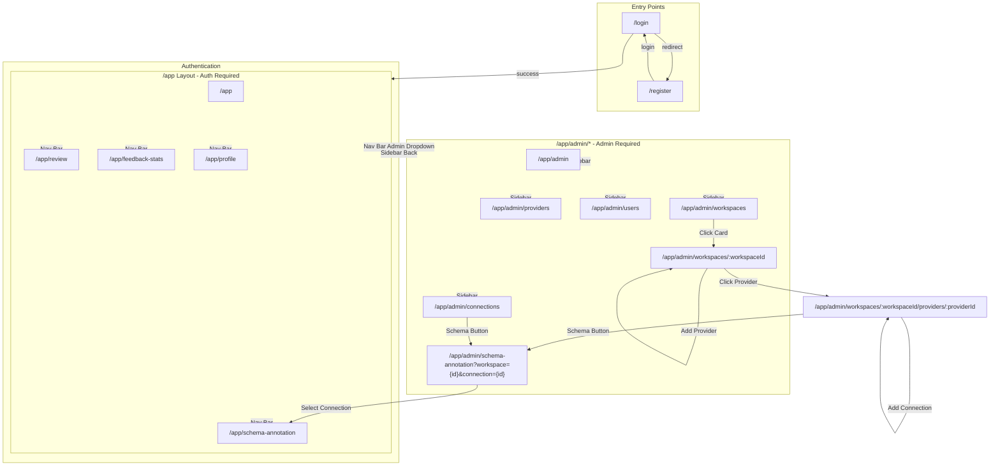
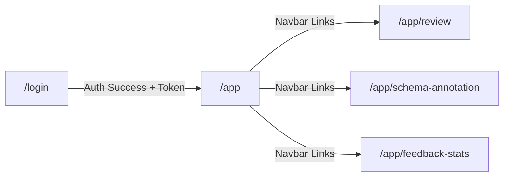
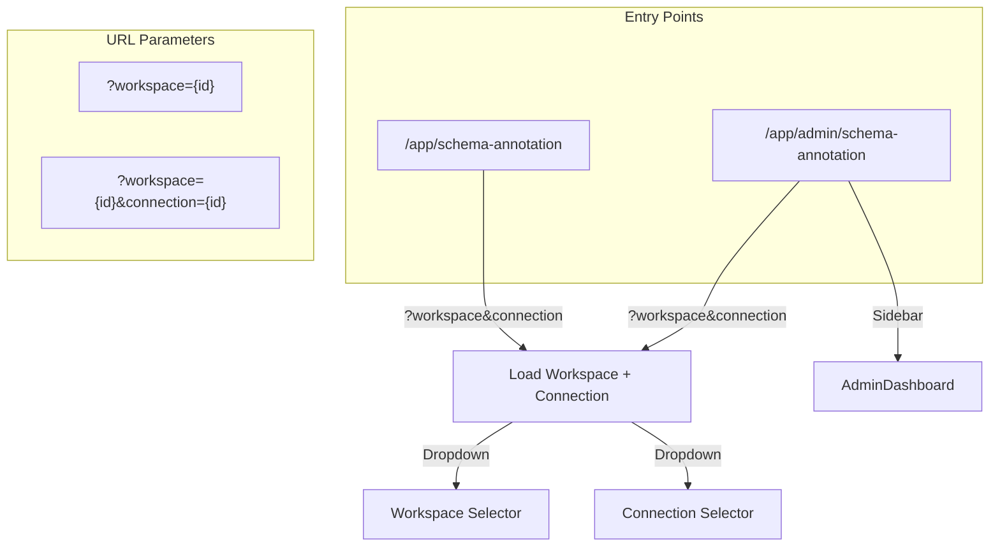

# Navigation Routing Graph

## Overview

This document provides a comprehensive view of all navigation paths in the Text2DSL application, from entry points through all possible routes.



## Detailed Path Analysis

### Entry Routes

| Route | Required Auth | Description |
|-------|---------------|-------------|
| `/login` | No | User login page |
| `/register` | No | User registration page |
| `/` | No | Redirects to `/app` |

### Protected App Routes (`/app/*`)

All routes require authentication via `ProtectedRoute` component.

| Route | Auth Level | Layout | Navigation |
|-------|------------|--------|------------|
| `/app` | User | AppLayout + Header | Chat interface |
| `/app/review` | User | AppLayout + Header | Review queries |
| `/app/schema-annotation` | User | AppLayout + Header | Annotate schemas |
| `/app/feedback-stats` | User | AppLayout + Header | Feedback statistics |
| `/app/profile` | User | AppLayout + Header | User profile |

### Admin Routes (`/app/admin/*`)

All routes require `admin` or `super_admin` role via `ProtectedRoute requireAdmin={true}`.

| Route | Auth Level | Layout | Navigation |
|-------|------------|--------|------------|
| `/app/admin` | Admin | AdminLayout | Admin dashboard |
| `/app/admin/workspaces` | Admin | AdminLayout | List all workspaces |
| `/app/admin/workspaces/:workspaceId` | Admin | AdminLayout | Workspace details + providers |
| `/app/admin/workspaces/:workspaceId/providers/:providerId` | Admin | AdminLayout | Provider details + connections |
| `/app/admin/providers` | Admin | AdminLayout | List all providers |
| `/app/admin/connections` | Admin | AdminLayout | List all connections |
| `/app/admin/users` | Admin | AdminLayout | User management |
| `/app/admin/schema-annotation` | Admin | AdminLayout | Schema annotation with admin sidebar |

## Navigation Flow Diagrams

### From Login to App



### Admin Sidebar Navigation

```mermaid
flowchart TB
    subgraph Sidebar["Admin Sidebar"]
        Back["← Back to App"]
        Dashboard["/app/admin"]
        Workspaces["/app/admin/workspaces"]
        Providers["/app/admin/providers"]
        Connections["/app/admin/connections"]
        Users["/app/admin/users"]
    end

    Back -->|/app|"Main App"
    Dashboard -->|""|
    Workspaces -->|Click Card| WSDetail["/app/admin/workspaces/:id"]
    WSDetail -->|Click Provider| ProvDetail["/app/admin/workspaces/:wsId/providers/:provId"]
    Providers -->|Click Provider| ProvDetail
    Connections -->|Schema Link| SchemaAnn["/app/admin/schema-annotation?workspace={id}&connection={id}"]
    ProvDetail -->|Schema Link| SchemaAnn
```

### Schema Annotation Deep Linking



## Component Navigation Hierarchy

```
App.jsx
├── Router
│   ├── Public Routes
│   │   ├── /login → Login
│   │   └── /register → Register
│   │
│   ├── ProtectedRoute (/app/*)
│   │   └── AppLayout
│   │       ├── Header (Navbar)
│   │       │   ├── WorkspaceSelector (only on /app)
│   │       │   ├── Chat → /app
│   │       │   ├── Review → /app/review
│   │       │   ├── Schema → /app/schema-annotation
│   │       │   ├── Feedback → /app/feedback-stats
│   │       │   └── Admin (Dropdown if super_admin)
│   │       │
│   │       └── Routes
│   │           ├── / → Chat
│   │           ├── review → Review
│   │           ├── schema-annotation → SchemaAnnotation
│   │           ├── feedback-stats → FeedbackStats
│   │           ├── profile → UserProfile
│   │           │
│   │           └── ProtectedRoute (/app/admin/*) + AdminLayout
│   │               ├── Sidebar
│   │               │   ├── Back to App
│   │               │   ├── Dashboard → /app/admin
│   │               │   ├── Workspaces → /app/admin/workspaces
│   │               │   ├── Providers → /app/admin/providers
│   │               │   ├── Connections → /app/admin/connections
│   │               │   └── Users → /app/admin/users
│   │               │
│   │               └── Routes
│   │                   ├── / → AdminDashboard
│   │                   ├── workspaces → Workspaces
│   │                   ├── workspaces/:id → WorkspaceDetail
│   │                   ├── workspaces/:wsId/providers/:provId → ProviderDetail
│   │                   ├── providers → Providers
│   │                   ├── connections → Connections
│   │                   ├── users → AdminUsers
│   │                   └── schema-annotation → SchemaAnnotation (with params)
```

## Route Parameters & Dynamic Paths

### Dynamic Route Parameters

| Route Pattern | Parameters | Example URL |
|--------------|-----------|-------------|
| `/app/admin/workspaces/:workspaceId` | workspaceId (UUID) | `/app/admin/workspaces/5a565a83-a28f-4803-ab22-ed2983cd6445` |
| `/app/admin/workspaces/:workspaceId/providers/:providerId` | workspaceId, providerId | `/app/admin/workspaces/5a565a83.../providers/33302f8e...` |
| `/app/schema-annotation` | workspace (query), connection (query) | `/app/schema-annotation?workspace=...&connection=...` |
| `/app/admin/schema-annotation` | workspace (query), connection (query) | `/app/admin/schema-annotation?workspace=...&connection=...` |

### Query Parameter Navigation

Routes that accept query parameters for deep linking:

| Route | Parameters | Purpose |
|-------|------------|---------|
| `/app/schema-annotation` | `workspace`, `connection` | Pre-select workspace and connection |
| `/app/admin/schema-annotation` | `workspace`, `connection` | Pre-select workspace and connection (admin mode) |

## Navigation Sources by Destination

### Destination: Schema Annotation Pages

Routes that can navigate to Schema Annotation:

| Source Page | Trigger | URL |
|-------------|---------|-----|
| AppLayout Navbar | Click "Schema" | `/app/schema-annotation` |
| ProviderDetail | Click Schema icon | `/app/admin/schema-annotation?workspace={id}&connection={id}` |
| Connections | Click "Schema" button | `/app/admin/schema-annotation?workspace={id}&connection={id}` |
| WorkspaceDetail | Click "Add Provider" → Provider → Schema | Chain navigation |
| URL Direct | Direct URL access | `/app/schema-annotation` or `/app/admin/schema-annotation` |

### Destination: Workspace Detail

Routes that can navigate to Workspace Detail:

| Source Page | Trigger | URL |
|-------------|---------|-----|
| Workspaces | Click workspace card | `/app/admin/workspaces/{workspaceId}` |
| ProviderDetail | Click breadcrumb | `/app/admin/workspaces/{workspaceId}` |

### Destination: Provider Detail

Routes that can navigate to Provider Detail:

| Source Page | Trigger | URL |
|-------------|---------|-----|
| WorkspaceDetail | Click provider | `/app/admin/workspaces/{wsId}/providers/{provId}` |
| Providers | Click provider | `/app/admin/workspaces/{wsId}/providers/{provId}` |

## Route Protection Matrix

| Route | Auth Required | Role Required | Protected By |
|-------|---------------|---------------|--------------|
| `/login` | No | None | Public |
| `/register` | No | None | Public |
| `/app` | Yes | user | ProtectedRoute |
| `/app/review` | Yes | user | ProtectedRoute |
| `/app/schema-annotation` | Yes | user | ProtectedRoute |
| `/app/feedback-stats` | Yes | user | ProtectedRoute |
| `/app/profile` | Yes | user | ProtectedRoute |
| `/app/admin/*` | Yes | admin | ProtectedRoute requireAdmin |
| `/app/admin/workspaces` | Yes | admin | ProtectedRoute requireAdmin |
| `/app/admin/workspaces/:id` | Yes | admin | ProtectedRoute requireAdmin |
| `/app/admin/providers` | Yes | admin | ProtectedRoute requireAdmin |
| `/app/admin/connections` | Yes | admin | ProtectedRoute requireAdmin |
| `/app/admin/users` | Yes | super_admin | ProtectedRoute requireAdmin |
| `/app/admin/schema-annotation` | Yes | admin | ProtectedRoute requireAdmin |

## Key Navigation Components

### AppLayout.jsx
- Main application layout with header navigation
- Contains navbar with links to: Chat, Review, Schema, Feedback
- Admin dropdown for super_admin users
- User menu with profile and logout

### AdminLayout.jsx
- Wraps admin pages with AdminSidebar
- Sidebar navigation to: Dashboard, Workspaces, Providers, Connections, Users
- "Back to App" link

### WorkspaceContext.jsx
- Manages current workspace state
- Provides `workspaces`, `currentWorkspace`, `selectWorkspace`
- Used for workspace-scoped data fetching

## Notes

1. **Dual Schema Annotation Routes**: `/app/schema-annotation` and `/app/admin/schema-annotation` both exist but have different layouts (AppLayout vs AdminLayout)

2. **Query Parameter Persistence**: Schema Annotation routes use query parameters (`?workspace=...&connection=...`) rather than URL path parameters for connection selection

3. **Workspace Selector**: Only appears on the main Chat page (`/app`) via the AppLayout header

4. **Admin Access**: Only super_admin users see the Admin dropdown in AppLayout and can access `/app/admin/*` routes

5. **Breadcrumb Navigation**: ProviderDetail and other detail pages implement breadcrumbs linking back through hierarchy
